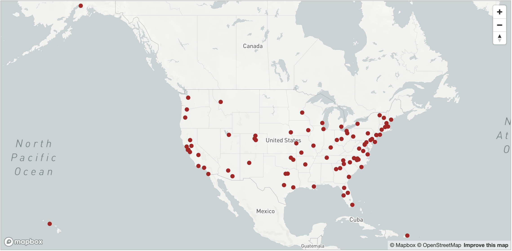

# The Code for America Network

Code for San Francisco is part of the Code for America brigade network, a national alliance of community organizers, developers, and designers that are putting technology to work in service of our local communities. We believe that government can work, for the people, by the people, in the digital age, if we all help.

While every brigade operates differently and according to what works locally, this vibrant community shares common values and goals. We collaborate on many projects, and meet throughout the year in national conferences.

To engage on a national level with Code for America, the best place to start is to join the [CfA Slack](http://slack.codeforamerica.org/).
